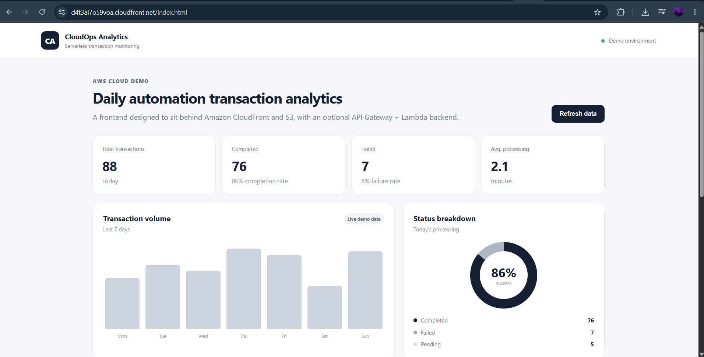
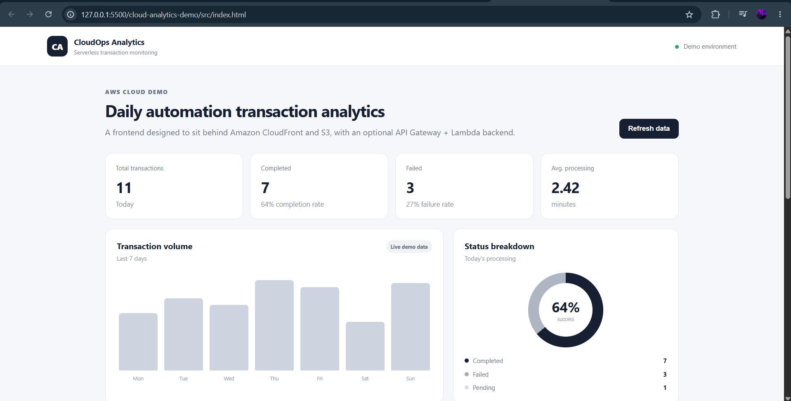
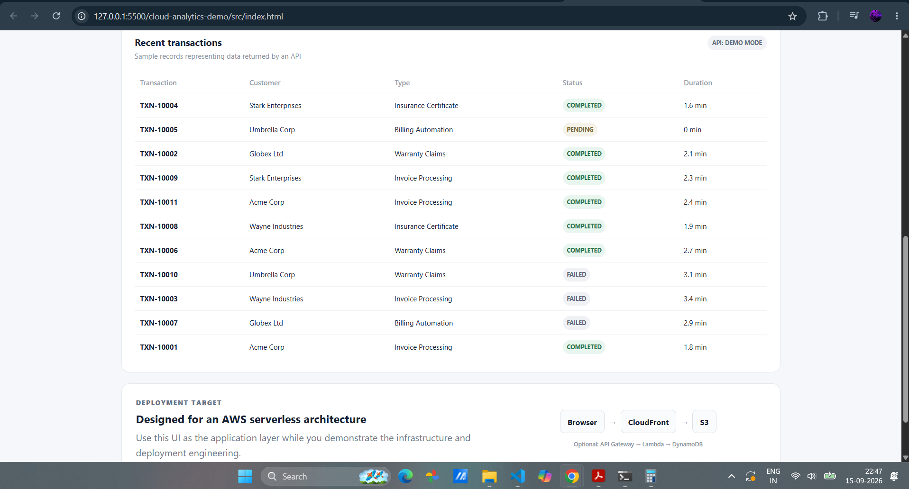
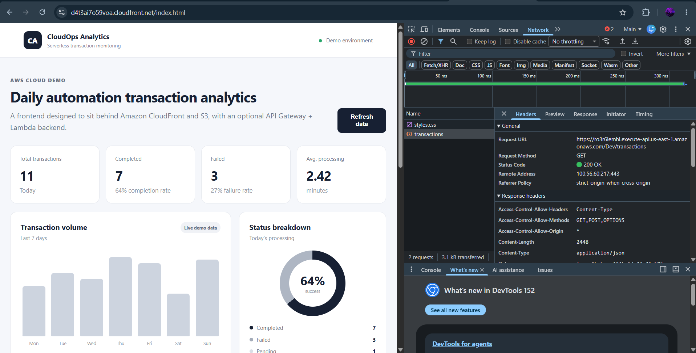

# Cloud Analytics Dashboard Demo

A small static web app designed to demonstrate an AWS cloud architecture.

## Intended architecture

┌─────────────────────────────────────────────────────────────────────┐
│                         CLOUD ANALYTICS PLATFORM                    │
│                                                                     │
│   USERS / EDGE                                                     │
│                                                                     │
│   ┌───────────┐       HTTPS       ┌──────────────────────┐          │
│   │   User    │ ─────────────────►│      CloudFront      │          │
│   └───────────┘                   │ CDN / HTTPS / Cache  │          │
│                                   └─────────┬────────────┘          │
│                                             │                       │
│                           ┌─────────────────┴─────────────┐         │
│                           │                               │         │
│                      Static Assets                    /api/*        │
│                           │                               │         │
│                           ▼                               ▼         │
│                    ┌────────────┐                  ┌────────────┐  │
│                    │ S3 Bucket  │                  │API Gateway │  │
│                    │   PRIVATE  │                  │    REST    │  │
│                    └────────────┘                  └─────┬──────┘  │
│                                                         │         │
│                                                         ▼         │
│                                                   ┌──────────┐    │
│                                                   │  Lambda  │    │
│                                                   │ Python   │    │
│                                                   └────┬─────┘    │
│                                                        │          │
│                                                        ▼          │
│                                                   ┌──────────┐    │
│                                                   │ DynamoDB │    │
│                                                   │Transactions│  │
│                                                   └──────────┘    │
│                                                                     │
│   DEVOPS / IaC                                                     │
│                                                                     │
│   ┌──────────┐     ┌──────────────┐     ┌──────────┐                │
│   │  GitHub  │────►│GitHub Actions│────►│ Terraform│                │
│   └──────────┘     └──────┬───────┘     └────┬─────┘                │
│                           │                    │                    │
│                           └──── Deploy ────────┘                    │
│                                                                     │
│   OBSERVABILITY / SECURITY                                          │
│                                                                     │
│        ┌────────────┐                         ┌───────────┐          │
│        │ CloudWatch │                         │    IAM    │          │
│        │ Logs/Alarms│                         │ Policies  │          │
│        └────────────┘                         └───────────┘          │
└─────────────────────────────────────────────────────────────────────┘

Browser
  -> CloudFront
  -> S3 (static frontend)

Optional backend extension:
Browser -> API Gateway -> Lambda -> DynamoDB

The frontend currently uses local demo data so it can be deployed immediately to S3/CloudFront.
The UI includes an API status panel where you can later point the app at an API Gateway endpoint.

## Deploy

Upload the contents of `src/` to an S3 bucket configured for your CloudFront origin.

For a production-style setup, prefer:
- S3 private bucket
- CloudFront Origin Access Control (OAC)
- HTTPS redirect
- CloudFront caching
- Route 53 custom domain (optional)
- GitHub Actions for deployment
- Terraform for infrastructure

## Suggested resume angle

"Built and deployed a serverless cloud analytics dashboard using S3, CloudFront and Terraform, with a CI/CD pipeline and API Gateway/Lambda extension."

## Resource Created Checklist
  -- S3 Bucket
  -- Cloudfront using S3
  -- DynamoDB Table
  -- Lambda Functions
  -- IAM Policy to allow Lambda scanDynamoDB and PutItem
  -- API Gateway (Rest API with Lambda integration Deployed in Dev Stage)

  {
	"Version": "2012-10-17",
	"Statement": [
		{
			"Sid": "VisualEditor0",
			"Effect": "Allow",
			"Action": [
				"dynamodb:PutItem",
				"dynamodb:Scan"
			],
			"Resource": "arn:aws:dynamodb:us-east-1:767397765208:table/demo-transaction-table"
		}
	]
}

## Output

URL (have cleaned up the services after POC to avoid cost): https://d4t3ai7o59voa.cloudfront.net/index.html

